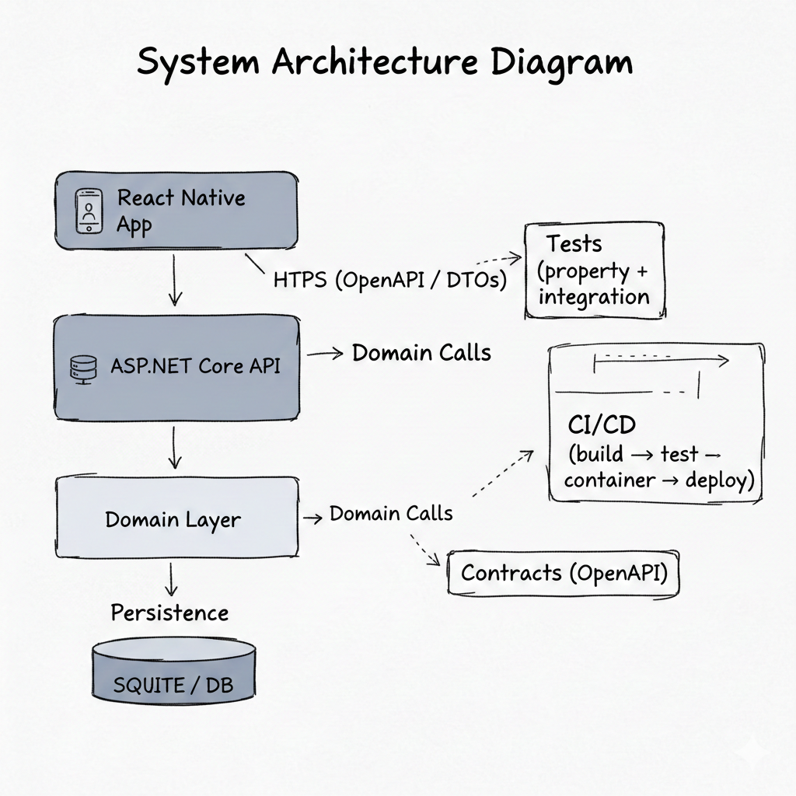
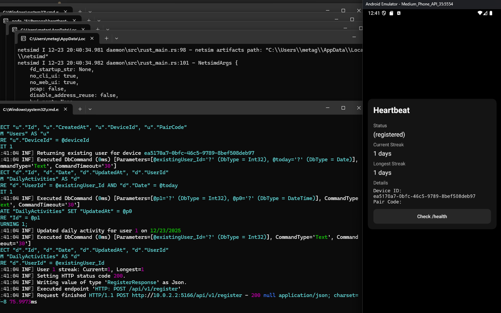

# Heartbeat

[](https://github.com/michael-tiller/heartbeat-server/actions/workflows/ci-cd.yml)
[](https://github.com/michael-tiller/heartbeat-server/pkgs/container/heartbeat-server)

---

## Overview

Heartbeat tracks daily user activity and calculates consecutive-day streaks.  
The project demonstrates **backend correctness**, **test discipline**, and **API-driven mobile integration**—not feature breadth.

### System Architecture



---

## What It Does

- Registers a user per device and issues a unique code
- Records a single daily activity per user
- Calculates:
  - Current streak (consecutive days)
  - Longest streak (historical max)

All streak logic lives in the domain layer and is fully deterministic.

---

## Stack

| Layer     | Tech                            |
| --------- | ------------------------------- |
| Backend   | .NET 10, ASP.NET Core           |
| Domain    | Pure C# domain model            |
| Database  | PostgreSQL (prod), SQLite (dev) |
| Mobile    | React Native, TypeScript        |
| Contracts | OpenAPI + generated clients     |
| Infra     | Docker, GitHub Actions, GHCR    |

---

## Structure

```
├── server/           # ASP.NET Core API
├── domain/           # Pure business logic
├── contracts/        # OpenAPI + generated clients
├── mobile/           # React Native app
├── domain.tests/     # Deterministic unit + property tests
└── server.tests/     # HTTP + database integration tests
```

Intentional separation:
- **Domain** has no framework dependencies
- **API** is a thin orchestration layer
- **Mobile** consumes generated contracts only

---

## API

- Versioned under `/api/v1`
- Errors use **RFC 7807 Problem Details**

### Endpoints

**Health**
- `GET /health`
- `GET /health/live`
- `GET /health/ready`

**Users**
- `POST /api/v1/register` — Registers a device, records daily activity, returns the user's code

---

## Demo



*Register a device and track your daily activity streak*

**API Example:**

```bash
curl -X POST http://localhost:5166/api/v1/register \
  -H "Content-Type: application/json" \
  -d '{"deviceId": "my-device-123"}'
```

Response:
```json
{
  "userCode": "ABC123",
  "currentStreak": 1,
  "longestStreak": 1
}
```

---

## 60-Second Local Run

Start the API and database with Docker Compose:

```bash
cd server
docker compose up -d
```

Wait ~10 seconds for services to start, then:

```bash
curl http://localhost:5166/health
```

- **API**: `http://localhost:5166`
- **Swagger**: `http://localhost:5166/swagger`
- **Database**: PostgreSQL on `localhost:5432`

Stop with: `docker compose down`

---

## Quick Start

### Backend

```bash
cd server
dotnet run
```

- API: `http://localhost:5166`
- Swagger: `http://localhost:5166/swagger`

### Mobile

```bash
cd mobile
npm install
npm run api:regenerate
npm start

# New terminal
npm run android   # or npm run ios
```

---

## Testing

```bash
dotnet test
```

- **Domain tests** — Property-based first (FsCheck), example tests for edge cases only
- **Integration tests** — Real HTTP pipeline, real database

See [Testing Guide](docs/TESTING-GUIDE.md).

---

## Deployment

```bash
docker build -f server/Dockerfile -t heartbeat-server .
docker run -p 5166:5166 \
  -e ConnectionStrings__DefaultConnection="Host=db;..." \
  heartbeat-server
```

CI builds, tests, and publishes images on push to `main` and `dev`.

---

## Why This Exists

Heartbeat is intentionally small. It demonstrates:

- Deterministic domain modeling
- Property-first testing
- Versioned APIs with standard error contracts
- Contract-driven mobile integration
- Production-shaped structure without over-engineering

---

## Docs

- [Testing Guide](docs/TESTING-GUIDE.md)
- [Migrations](docs/MIGRATIONS.md)
- [CI/CD](docs/CI-CD.md)
- [Mobile Readme](mobile/README.md)
- [Contracts Readme](contracts/README.md)
